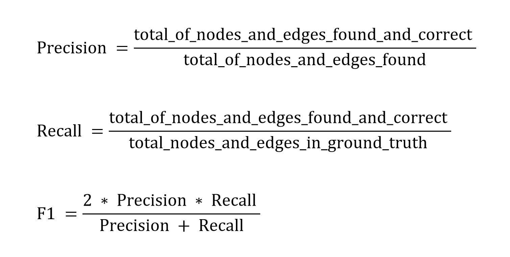

# Evaluation metrics

Teams are scored and ranked by F1 measure on the test set.
F1-measure are calculated based on nodes or edges matching of match summaries.

### Evaluation details

Node: a node a piece of information (e.g. team names, player names). 
Edge: a edge is a relation between 2 or more information (e.g. team names and scores).

List of nodes and edges are considered for evaluation:  

* team names
* team names and scores
* player names of score list
* player names of score list with time
* player names of score list with team
* player in and out
* player in, player out and time
* card player names
* card player names and time
* card player names and team

### F1-measure

### Notes

* Time evaluation: we focus on absolute time of the math (e.g: 90, phút 90, phút thứ 90, phút 90+2).
* Player and team name evaluation: The full name of player and team are expected and they must appear in the content of the article.
* Two teams of the match must be different.

### Docker's guideline
* [Public Guideline](https://dl.challenge.zalo.ai/news-summarization/News-Summarization-Docker-Tutorial.pdf)
* [Backup Guideline](./news-summarization-docker-tutorial.pdf)
